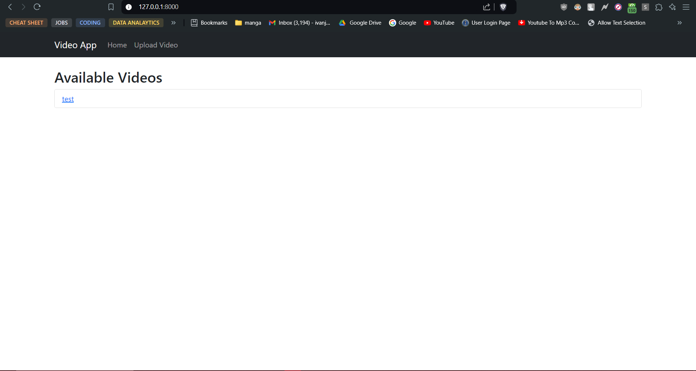
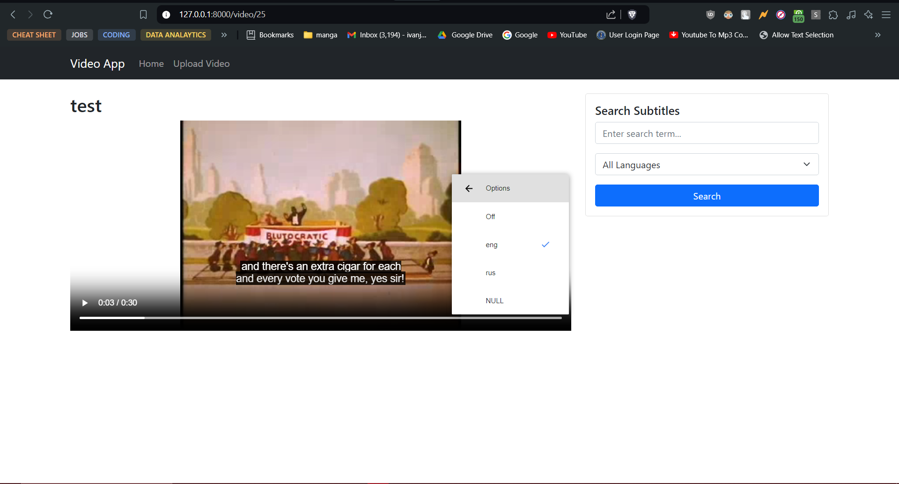
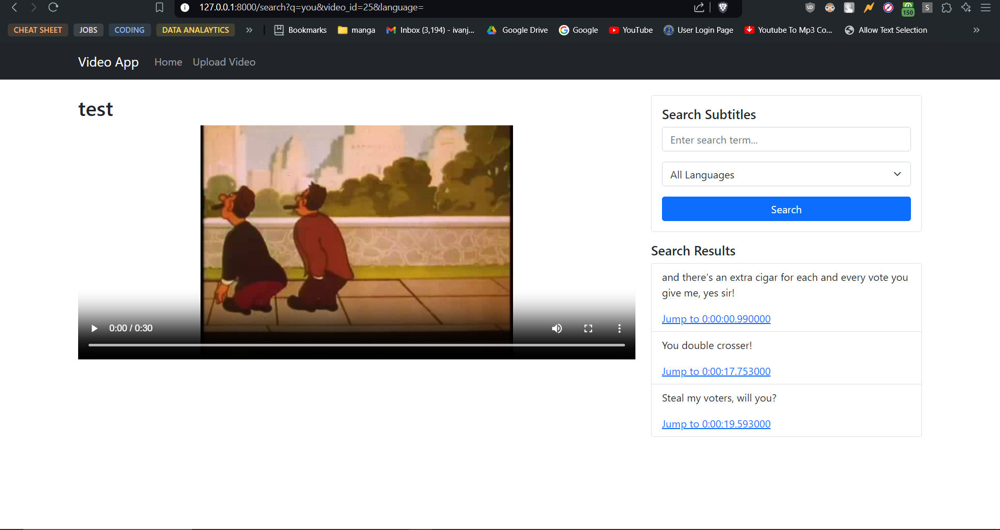

# Django Video Subtitle Search

## Project Overview

This project is a Django-based application that allows users to upload videos, extract subtitles, and search through subtitles to find specific phrases. Users can view videos, see subtitles, and search for phrases in subtitles, with results linked to the specific timestamp in the video.

## Features

- Upload videos and extract subtitles using `ffmpeg`.
- View videos with subtitles.
- Search for specific phrases within subtitles.
- Jump to the timestamp in the video where the phrase occurs.

## Screenshots

Below are some screenshots showcasing the application:

1. **Home Page**
   

2. **Subtitles Display**
   

3. **Search Functionality**
   

## Requirements

- Python 3.11.x
- Docker and Docker Compose
- PostgreSQL

## Setup Instructions

### Using Docker

1. **Clone the repository:**
    ```sh
    git clone https://github.com/yourusername/your-repo-name.git
    cd your-repo-name
    ```

2. **Build and start the Docker containers:**
    ```sh
    docker-compose up --build
    ```

3. **Run migrations:**
    ```sh
    docker-compose run web python manage.py migrate
    ```

4. **Create a superuser (optional):**
    ```sh
    docker-compose run web python manage.py createsuperuser
    ```

5. **Access the application:**
   Open your browser and navigate to `http://localhost:8000`.

### Without Docker

1. **Clone the repository:**
    ```sh
    git clone https://github.com/yourusername/your-repo-name.git
    cd your-repo-name
    ```

2. **Create a virtual environment and activate it:**
    ```sh
    python -m venv venv
    source venv/bin/activate  # On Windows use `venv\Scripts\activate`
    ```

3. **Install the requirements:**
    ```sh
    pip install -r requirements.txt
    ```

4. **Set up the database:**
    - Ensure PostgreSQL is running and create a database named `fatmug`.

5. **Run migrations:**
    ```sh
    python manage.py migrate
    ```

6. **Create a superuser (optional):**
    ```sh
    python manage.py createsuperuser
    ```

7. **Start the development server:**
    ```sh
    python manage.py runserver
    ```

8. **Access the application:**
   Open your browser and navigate to `http://localhost:8000`.

## Usage

- **Home Page:** Browse and select videos to view.
- **Video Page:** Watch videos, view subtitles, and use the search functionality.
- **Search Page:** Enter a phrase to search for and jump to the corresponding timestamp in the video.

## License

This project is licensed under the MIT License - see the [LICENSE](LICENSE) file for details.

## Acknowledgments

- [Django](https://www.djangoproject.com/) for the web framework.
- [ffmpeg](https://ffmpeg.org/) for subtitle extraction.
- [Bootstrap 5](https://getbootstrap.com/) for styling.


